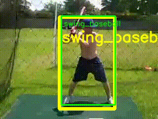

# Awesome-Spatio-temporal-human-action-detection-in-videos

Human spatio-temporal action detection is for answering when (from what time to what time), where (postions), and what actions occur in a given video. It is a crucial ability for selfdriving cars, autonomous care robots, and advanced video search engines. 

This repo is a collection of resources for spatio-temporal human action detection in videos.

.         

Above are demos on action detection. Green boxes are ground-truth. Others are detection results.

## Why Awesome Spatio-temporal Human action detection

Spatio-temporal human action detection in videos is a quite chanllenging task. This repo is tracking the developping of action detection and help to better understand the topic, from datasets, evaluation metrics, and SOTA methods.

**Feedback and contributions are welcome! Please feel free to pull a request for any issues and suggestions.**

## Table of Contents

* [Datasets](#datasets)
   * [Commanly used](#commonly-used)
   * [Potentially Used](#potentially-used)

* Metrics
   * Frame-mAP
   * Video-mAP

* Papers
   
## Datasets

### Commonly used

* **UCFSports-10**  - contains 10 sport classes in 150 **trimmed videos**.
   * [**paper**] [Action mach a spatio-temporal maximum average correlation height filter for action recognition.](http://cs.ucf.edu/~mikel/ActionMACH.pdf). Rodriguez, Mikel D and Ahmed, Javed and Shah, Mubarak. CVPR 2008.
   * [**website**] [https://www.crcv.ucf.edu/data/UCF_Sports_Action.php](https://www.crcv.ucf.edu/data/UCF_Sports_Action.php). 
   * [**annotation**] You can refer to [ACT-Detector](https://github.com/vkalogeiton/caffe/tree/act-detector) to prepare the dataset.

* **UCF101-24**  -  a subset of UCF101. It contains 24 **sport** classes in 3207 **untrimmed videos**. Each video contains a single action category. Multiple action instances with the same class, but different spatial and temporal boundaries may occur. 
   * [**paper**] [UCF101: A Dataset of 101 Human Actions Classes From Videos in The Wild.](https://arxiv.org/abs/1212.0402). K. Soomro and A. Zamir and M. Shah. 2012.
   * [**website**] [http://www.thumos.info/download.html](http://www.thumos.info/download.html).
   * [**annotation**] The offical annotations for UCF101-24 can be downloaded from [here](http://www.thumos.info/download.html). **Noted** Most recent papers use the corrected version **UCF101-24 v2** from [corrected-UCF101-Annots](https://github.com/gurkirt/corrected-UCF101-Annots) by Gurkirt. You can refer to [ACT-Detector](https://github.com/vkalogeiton/caffe/tree/act-detector) to prepare the dataset.

* **JHMDB51-21**  - contains 21 action categories in 928 **trimmed videos**.
   * [**paper**] [Towards understanding ac- tion recognition.](https://hal.inria.fr/hal-00906902/document).Jhuang, Hueihan and Gall, Juergen and Zuffi, Silvia and Schmid, Cordelia and Black, Michael J. ICCV 2013.
   * [**website**] [http://jhmdb.is.tue.mpg.de](http://jhmdb.is.tue.mpg.de). 
   * [**annotation**] You can refer to [ACT-Detector](https://github.com/vkalogeiton/caffe/tree/act-detector) to prepare the dataset.

